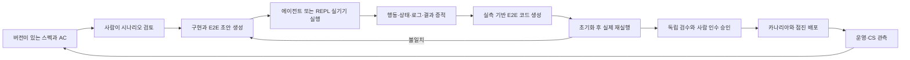

# SDD·실기기 검증·개발 조직 통합 기준

합의 기록일: 2026-09-08. 사용자와 합의한 목표의 설계 정본이다.
이 문서의 합의는 개별 제품 시나리오의 인수 승인이나 운영 배포 승인이 아니다.
요구사항 ID·담당·구현 순서·완료 조건은 [실행 명세](sdd-device-program.json)를 따른다.
운영 상태는 PostgreSQL의 실행·검수·배포 기록으로 확인한다. 문서 작성은 기능 구현이 아니다.

## 기존 목표와의 연결

자기 자신을 만드는 Codex 하네스가 최상위 목적이다. 기존 [설계](design.md),
[연구 기준](research-standard.md), [모델 인계 절차](progressive-model-handoff.md)를 유지한다.
지휘자→팀장→팀원의 3계층, 헥사고날 아키텍처, 결정론적인 script 우선,
육하원칙 JSON, Git 정의 SSOT·PostgreSQL 운영 SSOT, GraphRAG 파생 색인,
Tree-sitter와 계약 ID 주석 규칙은 모든 신규 팀에도 적용한다.

컨텍스트 70%에서 작업·증거·온톨로지/토폴로지를 저장하고 새 세션으로 인계한다.
이전 generation의 쓰기를 거부한다. 진행 중인 도구/기기 작업을 비활동으로 오인하지 않는다.
1시간 비활동 종료와 메시지 기반 재기동, 자원 예산·대기열은 신규 팀에도 적용한다.
기기 공급자의 lease/idle timeout은 별도이며 하네스의 1시간 규칙으로 덮어쓰지 않는다.

동일 문제의 독립적인 두 번째 발생은 예방·복구 훅의 필수 개선 작업으로 연결한다.
기존 검증을 우회하는 훅을 즉시 활성화하는 뜻은 아니다. 재현·정상 대조군·독립 검수·
실제 Codex CLI 카나리아와 되돌리기 경로를 통과해야 한다.
Astra 기준 수행→Sol 가드레일과 동등 수행 검증→Terra 가드레일과 동등 수행 검증→
Astra 최종 검수를 유지한다. 모델 이름만으로 하향 라우팅하지 않는다.

## 조직

| 팀 | 책임 | 독립 검토 경계 |
| --- | --- | --- |
| 스펙 | 사용자 의도·범위·핵심 여정·AC·변경 영향 | 핵심 경험과 기대 결과는 사람이 확인 |
| 프론트엔드 | 디자인 분석·인터랙션·컴포넌트·제품 UI | QA/QC가 실제 결과와 증적 검수 |
| 백엔드 | 도메인·API·데이터·거래 정합성 | QA/QC의 계약·통합·업무 결과 검증 |
| QA/QC | QA: 예방 절차·검증 설계, QC: 실측·증적·인수 판정 | 구현자가 자신의 변경을 단독 승인하지 않음 |
| DevOps | 재현 환경·기기·CI/CD·점진 배포·관측·복구 | 검수된 후보와 배포 정책에 구속 |
| 리서칭 | 오픈소스·표준 조사와 근거 분석 | 독립 연구 검수 후 채택 |
| 하네스 고도화 | 하네스·scripts·skills·훅 자체 개선 | 기존 팀장/지휘자/카나리아 절차 유지 |

지휘자는 업무 우선순위·의존성·조직 그래프·평가 기준·업무 승인을 관리한다.
팀장은 작업 분해·팀원 배정·작업 검수를 담당한다. 조직은 논리적 역할 정의이며,
전 팀원을 상시 컨테이너로 띄우지 않는다. 실행기/권한/큐/복구를 갖춘 팀부터 활성화한다.

## 프론트엔드 반복 절차

| 순서 | 단계 | 필수 산출물과 완료 근거 |
| --- | --- | --- |
| 1 | 스펙 논의 | 기획·범위·핵심 시나리오·정상/실패/취소/복구 AC와 사람 확인 |
| 2 | 디자인 분석 | 스펙과 인터랙션 연결, 상태 전이, 접근성, Storybook 검토 |
| 3 | 코드 작성 | 공통 컴포넌트·UI·API 연결, 코드와 테스트 변경의 추적성 |
| 4 | 자체 검증 | 실제 기능·환경 검사, 명세 대비 결과, 실패 기록 보존 |
| 5 | 알파 배포 | 고정 빌드·설정·데이터 준비 절차·접근 가능한 알파 환경 |
| 6 | QA 및 증적 | 실제 기기 E2E/인수 증적, 핵심 경험에 대한 사람 승인 |
| 7 | 라이브 배포 | 동일 후보의 단계적 전환, 상태 관측, 중단/복구 조건 |
| 8 | CS 대응 | 사용자 문제·장애·실측을 다음 스펙과 회귀 테스트로 환원 |

실패는 원인이 있는 단계로 복귀한다. 재시도는 유한하며 실패/재시도 성공을 구분한다.
명세·AC·코드·환경·테스트가 바뀌면 의존 그래프를 따라 영향을 받는 승인을 무효화한다.
구현이 통과하도록 자동 수정하되, 기대값 완화·assertion 삭제·skip·mock 응답으로
통과시키지 않는다. 명세 자체의 변경은 변경 이유와 사람의 재확인이 필요하다.

## 하나로 연결되는 개발과 테스트

스펙에서 시나리오와 실행 전 E2E 초안을 만들 수 있다. 초안은 관측 사실이 아니다.
사람의 실제 수행이나 에이전트의 실기기 수행으로 검증하고, 그 기록으로 코드를 보강한다.
관측된 결과를 정답으로 자동 채택하지 않고 승인된 AC와 비교한다.
같은 명세가 생성과 독립 검증을 연결하며, 같은 잘못된 추론이 양쪽을 동시에 통과시키지
않도록 QC와 사람 검토를 둔다.

실행 계약은 시나리오/AC ID, spec revision, 앱·서버 빌드 해시, 환경 manifest,
데이터 초기 상태/준비 절차, 계정·권한의 참조, 기기/OS/driver, locale/timezone,
단계별 안정적인 요소 식별자·사전/사후 조건·대기 조건·시간 제한,
실제 결과와 evidence refs, 미검증 사항, 실행·승인 주체를 연결한다.
secret 값은 명세나 로그에 넣지 않고 통제된 참조로 전달한다.

동일 결과는 모든 timestamp/영상 픽셀이 같다는 의미가 아니라, 명시된 허용 오차 안에서
동일한 업무 결과와 실패 처리를 재현한다는 의미다. OS·네트워크·외부 서비스 차이는
환경 차이로 기록하며 숨기지 않는다. 실제 서비스·DB·공식 외부 테스트 환경을 사용하고
API mock/stub, HAR 응답 대체, 녹화 응답으로 인수 통과를 만들지 않는다.
공식 테스트 환경과 라이브의 차이도 증적에 남긴다.

금전 흐름은 금액·통화·반올림·수수료, 중복 제출/재시도, 불명확한 처리 결과,
취소·환불·부분 실패, 권한과 거래 상태, UI↔서버/거래 기록의 일치를 필수로 검증한다.
결과가 불명확한 금전 동작을 단순 재실행하지 않고 실제 상태를 먼저 조회한다.

## Device SDK·MCP·REPL·Live·Replay

공통 application use case와 Device port를 에이전트 MCP, REPL, 생성된 E2E가 공유한다.
기기 예약/lease, 연결, observe, interact, checkpoint, evidence, reset, release를
동일한 의미로 제공한다. 공급자별 capability와 실제 기기/시뮬레이터 구분을 숨기지 않는다.
하나의 기기에 한 시점의 조작 소유자를 둔다. 사람이 takeover하면 에이전트를 멈추고
기존 lease를 무효화하며, 개입·이후 재개를 증적으로 남긴다.

`log-to-scenario`는 조작 기록·UI 상태·클라이언트/서버 trace를 연결해 초안을 만든다.
서버 로그만으로 사용자의 의도나 화면 조작을 발명하지 않는다. 누락은 질문으로 표시한다.
Replay는 승인된 절차를 실제 기기에 다시 실행한다. 영상 재생은 증적 열람 기능이다.
실패 지점 재개는 디버깅 증적이고, 정식 E2E 통과는 초기 상태에서 전체 실행으로 얻는다.
선택자 변경·agent repair는 새 후보이며 이전 실행/승인과 구분한다.

Device Farm SDK의 특정 제품은 미확정이다. AWS Device Farm, Appium Device Farm,
Callstack agent-device는 비교 후보이며 설치·도입·실기기 검증 완료가 아니다.
Windows Docker 제어면과 iOS 실행 호스트 등 플랫폼별 실행 환경을 분리해 평가한다.
Playwright MCP/기존 Chrome 탭 그룹 사용 의도, Context7 문서 조회도 유지한다.
일상 Chrome 탐색 세션과 재현 가능한 정식 테스트 세션은 증적상 구분한다.

## 사람 친화적인 검토 VIEW와 디자인 시스템

VIEW는 스펙·범위 편집, 시나리오 흐름도, Storybook 상태, Device Live/REPL,
기대값↔실측 비교, 코드/테스트 diff, trace/영상/log 탐색, 변경 영향과 승인,
조직/큐/병목/자원/비용 상태를 연결한다. 각 상태는 원본 증거로 이동할 수 있어야 한다.
미실행·실패·차단·불안정·재시도 성공·사람 대기를 성공과 구분한다.
승인은 특정 revision과 증거 묶음에만 적용한다. 새 버전을 자동 승인하지 않는다.
기존 로컬/LAN 모니터링 접근을 유지하되, 단순 현황판을 검토 완료 VIEW로 부르지 않는다.

기준 조합은 shadcn/ui + Lucide 아이콘 + CSS 변수 디자인 토큰 + Storybook이다.
Lucide는 아이콘 라이브러리이며 별도 UI 컴포넌트 프레임워크로 취급하지 않는다.
색상·서체·간격·반경·그림자·레이어·모션과 light/dark 의미 토큰을 정한다.
컴포넌트에서 임의 값 사용은 예외 사유가 필요하다. 제품과 Storybook은 같은 컴포넌트를 쓴다.

Storybook은 수량 목표보다 필요한 상태의 누락 여부를 관리한다: 기본/포커스/비활성/
로딩/오류, 빈 데이터/긴 문구/경계값/부분 실패, 반응형/키보드/접근성/다국어,
폼·다이얼로그·테이블·알림·내비게이션, 제출/취소/복구/금전 흐름을 AC와 연결한다.
명시적인 컴포넌트 입력 상태는 디자인 설명이며 실제 backend 성공을 가장하지 않는다.
Storybook 확인만으로 제품 통합·실기기 인수 통과를 선언하지 않는다.

공식 참고: [shadcn 테마](https://ui.shadcn.com/docs/theming),
[Storybook 스토리](https://storybook.js.org/docs/writing-stories),
[Lucide](https://lucide.dev/guide/). 패키지 버전과 실제 프론트 빌드 도구는 구현 PR에서 고정한다.

## 하네스 자체의 전체 실행 경로 로깅과 알림

모든 제어 경계에 구조화된 이벤트를 남긴다: 메시지 생성/발행/수신/중복/ACK,
업무·작업 상태 전이/배정/lease, 모델·도구 호출 시작/종료/실패/취소, 컨텍스트 인계,
기기 예약/소유권/사람 개입/초기화, 스펙 변경/승인 무효화, 증적 저장/검증,
검수/카나리아/배포/복구, 자기 개선 발생/훅 활성화, 자원 정리/삭제 결과.
전체 경로 로깅은 비밀번호·토큰·원문 결제정보까지 무차별 수집하라는 의미가 아니다.
도구 출력은 크기 제한·민감정보 제거 후 별도 artifact로 보존하고 로그는 참조를 가진다.

각 이벤트는 event/schema ID, event time/observed time, trace/span/correlation ID,
causation/message/task/run ID, actor/team, session/generation, revision, environment,
event type/severity, 전후 상태·결과·사유 코드, 소요 시간, 증적 refs를 연결한다.
해당 없는 필드는 명시적으로 구분한다. 서로 다른 프로세스의 시계 차이로 사건 순서를
단정하지 않고 causation과 상태 버전으로 정렬한다.

필수 감사 사건은 샘플링으로 누락하지 않는다. 고빈도 성능 상세는 제한·집계하고
누락/드롭 수를 노출한다. 로그 생성기가 죽거나 collector가 멈춘 경우는 독립 watchdog이
heartbeat/sequence gap으로 감지한다. 알림 시스템 자신의 실패도 감시 대상이다.
영속 사건과 상태 변경은 같은 트랜잭션 또는 신뢰할 수 있는 로컬 spool/outbox로 묶는다.
저장 실패 때문에 관측하지 못한 실행을 통과로 인증하지 않는다. 이미 진행 중인 복구는
기록 시스템 장애에도 수행 가능해야 하며, 복구 뒤 기록을 대조한다.

| 알림 조건 | 반드시 구분할 내용 |
| --- | --- |
| 실패·복구 실패·Codex CLI 기동/작업 오류 | 원인, 영향 범위, 현재 운영 버전, 실행 증거 |
| 큐/판단 대기 기한 초과·heartbeat/ACK 미도착 | 활성 실행 여부, 자원 부족, lease와 마지막 진행 시점 |
| 필수 스펙/AC/증적/검수 누락·hash 불일치 | 누락 대상 ID, 막힌 단계, 해소 조건 |
| 거래 상태 불일치·결과 불명확 | 추가 실행 중단 여부, 실제 상태 조회와 담당자 |
| 알림/로그 전송 실패·버퍼 포화·sequence gap | 재전송 상태, 누락 범위, 관측 신뢰도 |
| 컨텍스트 인계 실패·자원/비용 한도·기기 lease 종료 임박 | 잔여 시간, 안전한 인계/종료 경로 |

심각도와 notification 정책은 분리한다. 사건 fingerprint로 중복을 묶되 독립 재발 횟수와
각 원문 증거를 보존한다. cooldown·단계적 escalation·owner·해소 조건을 버전화한다.
알림 상태는 pending→delivered→acknowledged→resolved이며 확인을 해결로 취급하지 않는다.
외부 전송은 성공 ACK 이후 delivered로 기록하고, 실패하면 영속 큐에서 제한적으로
재시도한다. 자동 해결 이벤트에도 검증 근거가 필요하다.

첫 알림 채널은 로컬/LAN VIEW의 notification inbox와 실시간 사건 목록이다.
Slack/email/push 등 외부 수신처는 현재 미정이며 연결·발송 완료로 간주하지 않는다.
로그 조회의 접근 제어, 보존 기간·용량, 원문과 파생 인덱스의 삭제 정책, 승인/장애 증적
보존도 DevOps와 QA/QC의 필수 검증 항목이다. 이 절차의 구현 검증에는 저장/전송 장애,
중복·역순·재시작·누락·폭주와 정상 비알림 대조군을 포함한다.

## 연구·마이그레이션과 현재 경계

Baldrix, harness/guardian, oh-my-hermes, Ouroboros와 진행 중인 다른 참조의 의무를 유지한다.
역방향 분석, init/기술스택 YAML, 스킬 선택·생성, agent/debate, pre/post hooks,
엄밀한 자기 개선·RLM·백엔드 테스트 자산을 pin·전체 경로 목록·호출 관계·실행 증거로
분석한다. inventories나 README 요약을 전체 분석/채택 완료로 세지 않는다.
Google SRE·arc42 등은 출처가 있는 측정 기준으로 연결하고 기준 개정도 독립 검수한다.

확인 기준 커밋 0548efaf1bc8833c750c80b242de03b5a73d7799에서 파이프라인 추천과
스택별 원본 YAML은 존재하지만 verified_complete=false이며 게이트를 실행하지 않는다.
조직 파일에는 연구·고도화팀만 있다. 5개 개발팀, SDD 실행 승인, Device SDK와
실측→E2E, Storybook/검토 VIEW는 이 문서로 구현되는 것이 아니다.
상세 격차와 실측 연구는 [PR 16](https://github.com/trevi00/codex-harness/pull/16)을 참조한다.

첫 완료 단위는 실제 대상 앱의 승인된 핵심 시나리오 한 건이다. 스펙/VIEW 검토,
실기기 완료, 기록→E2E 생성, 데이터 초기화, 재실행 결과, 독립 검수와 사람 확인까지
연결한 뒤 범위를 확장한다. 대상 앱·플랫폼·기기/공급자 접근·공식 테스트 계정은
실행 전 확정해야 하며, 없는 자원을 mock으로 대체해 완료시키지 않는다.
